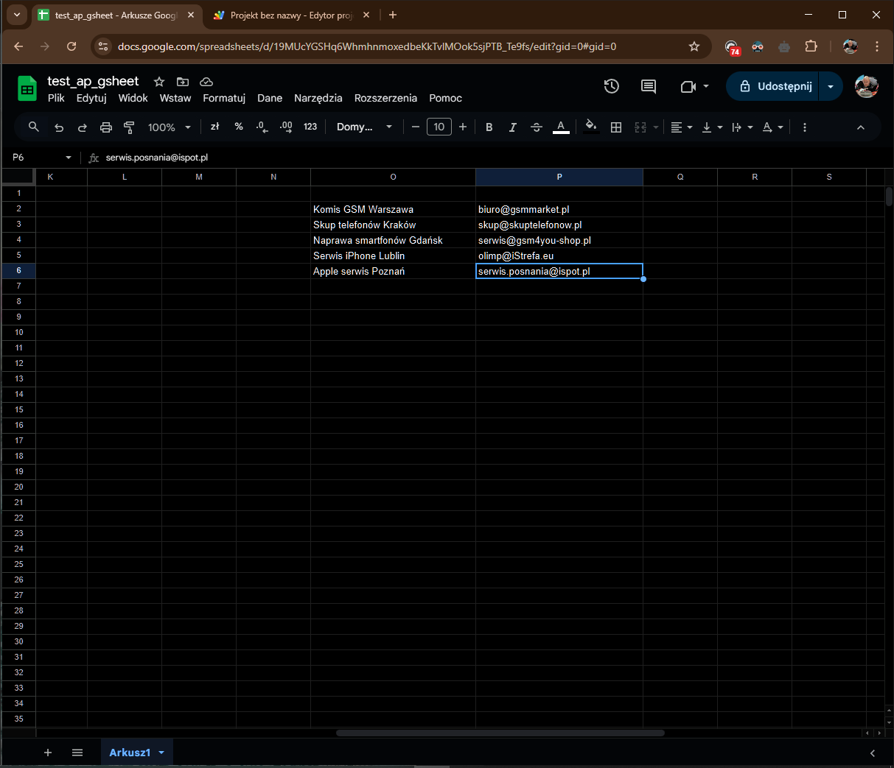

# Email Collector – Google Sheets + Serper.dev API

## 🎯 Cel projektu
Zautomatyzowane pobieranie adresów e-mail dla firm z wyników wyszukiwania Google, z wykorzystaniem API Serper.dev i Google Apps Script.  
Wyniki trafiają do arkusza Google Sheets. Projekt przydatny w email discovery, automatyzacji kontaktów i testach scrapingu.

## 🛠 Technologie
- Google Apps Script  
- Serper.dev API (`POST https://google.serper.dev/search`)  
- Google Sheets

## ⚙ Jak działa?
1. W kolumnie `O2:O47` arkusza wpisujesz nazwy firm.
2. Skrypt łączy się z Serper.dev za pomocą API_KEY i wysyła zapytania (10 firm na raz).
3. Pobiera dane z wyników Google: najpierw szuka e-maili w snippetach.
4. Jeśli nie znajdzie – przechodzi na stronę WWW i robi scraping (z obsługą `mailto`, `data-email`, itp.).
5. Zwraca pierwszy znaleziony e-mail i wpisuje go do kolumny `P`.

## ✅ Zakres działania
- Źródło danych: `O2:O47`
- Wyniki: `P2:P47`
- Batch size: 10 zapytań

## 📁 Struktura
- `src/main.gs` – główny skrypt Apps Script
- `sample_data/test_companies.csv` – przykładowe dane wejściowe
- `screenshots/sample.png` – przykład działania w arkuszu

## 🔗 API
[Serper.dev – dokumentacja](https://serper.dev)

## 🤖 Pomoc AI
Projekt zaplanowany i zrealizowany z pomocą ChatGPT – od promptów, przez kod, aż po regex i debug.

## 📸 Screenshot

## 🛡️ Zastrzeżenie prawne / Informacja o danych (PL)

Ten projekt służy wyłącznie do celów edukacyjnych i demonstracyjnych. Skrypt pobiera publicznie dostępne dane kontaktowe (adresy e-mail) widoczne na stronach internetowych firm.

Nie wykorzystuję tych danych do kontaktów marketingowych, masowego mailingu ani sprzedaży. Dane nie są gromadzone, przetwarzane ani przechowywane w sposób naruszający przepisy RODO lub Ustawy o świadczeniu usług drogą elektroniczną.

Użytkownicy, którzy planują wykorzystać ten skrypt do działań operacyjnych, powinni samodzielnie ocenić zgodność z obowiązującymi przepisami prawa.

---

## 🛡️ Legal Disclaimer / Data Usage (EN)

This project is for educational and demonstrational purposes only. The script fetches publicly available contact information (email addresses) visible on official company websites.

The collected data is not used for marketing, bulk emailing, or commercial outreach. No personal data is stored, processed, or handled in violation of GDPR or any applicable data protection laws.

Anyone intending to use this script operationally is responsible for ensuring legal compliance in their jurisdiction.
